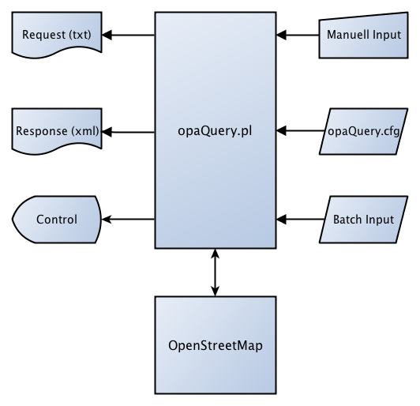

## opaQuery.pl
### Overpass-Api Data Query (Linux, OS X, Windows)

opaQuery.pl ist ein kleines, aber doch recht mächtiges Perl-Programm für Windows, Linux und OS X. Das Utility benutzt das Overpass-Api, und hier die Overpass-QueryLanguage (QL), um Daten aus der OpenStreetMap-Datenbank abzufragen. Das Tool wird von der Kommandozeile (Terminal, Konsole) aus benutzt und kann auch in automatisierten Batchabläufen eingesetzt werden.



```
opaQuery.pl - OpenStreetMap - OverPass-Api-Query, Rel. 0.4 - 2012/10/06

Copyright (C) 2012 Klaus Tockloth <freizeitkarte@googlemail.com>
This program comes with ABSOLUTELY NO WARRANTY. This is free software,
and you are welcome to redistribute it under certain conditions.

Benutzung
=========
perl opaQuery.pl [-prefix=String] "Overpass-QL-String"
perl opaQuery.pl [-prefix=String] 'Overpass-QL-String'

Optionen:
-prefix = Ausgabedateipraefix (default = opaQuery)

Beispiel (Windows)
==================
perl opaQuery.pl "node ['name'='Roxel'] (51.8, 7.4, 52.1, 7.8); out meta;"
perl opaQuery.pl "node [name=Roxel] (51.8, 7.4, 52.1, 7.8); out meta;"

Beispiel (Linux, OS X) [bash]
=============================
perl opaQuery.pl 'node ["name"="Roxel"] (51.8, 7.4, 52.1, 7.8); out meta;'
perl opaQuery.pl 'node [name=Roxel] (51.8, 7.4, 52.1, 7.8); out meta;'

Dateien
=======
opaQuery.Request.txt : Logdatei fuer die http-Anfrage (default)
opaQuery.Response.xml : Logdatei fuer die xml-Antwort (default)
opaQuery.cfg : Konfigurationsdatei


Overpass-QL - grundlegende Sprachelemente
-----------------------------------------

Initialisierung
===============
[out:xml]            Ausgabe der Objekte im xml-Format (Default)
[out:json]           Ausgabe der Objekte im json-Format
[timeout:sekunden]   maximale Verarbeitungsdauer im Server in Sekunden (Default: 180)
[maxsize:byte]       maximaler RAM-Verbrauch im Server in Byte (Default: 512 MB; Max: 1024 MB)

Zu selektierender Objekttyp
===========================
node   Knoten
way    Linie
rel    Relation

Selektion nach Schluesselwerten
===============================
['key' = 'value']     Uebereinstimmung gegeben
['key' != 'value']    Uebereinstimmung nicht gegeben
['key']               Schluessel vorhanden (Wert irrelevant)
['key' !~ '.']        Schluessel nicht vorhanden (Sondersyntax)
['key' ~ 'RegExp']    regulaerer Ausdruck trifft zu
['key' !~ 'RegExp']   regulaerer Ausdruck trifft nicht zu

Besondere Selektionen
=====================
(id)                  nur das Objekt mit angegebener ID
(user:'name')         nur Objekte des Users 'name'
(newer:'timestamp')   nur Objekte neuer als Timestamp (Beispiel: '2012-09-14T07:00:00Z')

Logische Verknuepfungen
=======================
['key1' = 'value1'] ... ['keyN' = 'valueN']   logische Und-Verknuepfung
['key' ~ 'value1|value2| ... |valueN']        logische Oder-Verknuepfung

Zu betrachtender Datenbereich
=============================
(sued, west, nord, ost)   rechteckige Box mit Koordinaten 'links unten + rechts oben'

Behandlung der selektierten Objekte
===================================
out limit  Ausgabe von maximal 'limit' Objekten (Default = keine Beschraenkung)
out        Kurzform fuer: Ausgabe aller Objekte im xml-Format

Detaillierung der selektierten Objekte
======================================
ids    nur Objekt-IDs
skel   Objekt-IDs + enthaltene Objekte
body   Objekt-IDs + enthaltene Objekte + Tags (Default)
meta   Objekt-IDs + enthaltene Objekte + Tags + Metadaten

Sortierung der selektierten Objekte
===================================
asc   Sortierung nach IDs (default)
qt    Sortierung nach Quadtiles

Beispiele - einfache Datenabfragen
==================================

"[Initialisierung] ; Objekttyp [Selektion]           (Datenbereich)         ; Behandlung Detaillierung Sortierung ;"
"----------------- ; --------- ------------------    ---------------------- ; ---------- ------------- ---------- ;"
"                    node      ['name'='Gielgen']    (50.7, 7.1, 50.8, 7.2) ; out        meta                     ;"
"[out:json]        ; node      ['name'~'[gG]ielgen'] (50.7, 7.1, 50.8, 7.2) ; out        meta                     ;"
"[timeout:2000]    ; node      ['name'~'Gielgen$']   (50.7, 7.1, 50.8, 7.2) ; out 3      body          qt         ;"
"                    way       (user:'toc-rox')      (50.7, 7.1, 50.8, 7.2) ; out        meta                     ;"

Beispiele - weitere Datenabfragen
=================================
"[out:json] [timeout:1900]; node ['name'='Gielgen'] (50.7, 7.1, 50.8, 7.2); out meta;"
"way (user:'toc-rox')   (50.7, 7.1, 50.8, 7.2); out meta;"
"node (newer:'2012-10-01T13:30:00Z') (50.7, 7.1, 50.8, 7.2); out meta;"

Rekursionsoperatoren bei Knoten und Linien (node, way)
======================================================
<    Ausgabe aller Knoten, Linien und Relationen (nodes, ways, rels) in denen das Objekt vorkommt
>    Ausgabe aller enthaltenen Knoten (nodes)

Rekursionsoperatoren bei Relationen (rel)
=========================================
<<   Ausgabe aller Relationen (rels) in denen die Relation vorkommt
>    Ausgabe aller enthaltenen Knoten und Linien (nodes, ways)
>>   Ausgabe aller enthaltenen Knoten, Linien und Relationen (nodes, ways, rels)

Beispiele - Ausgabe der abhaengigen Objekte
===========================================
"(node (530904873); <;); out;"   Knoten 530904873 und alle Objekte (ways, rels) in denen der Knoten vorkommt
"(way (42674611);   <;); out;"   Linie 42674611 und alle Relationen (rels) in denen die Linie vorkommt
"(rel (157770);    <<;); out;"   Relation 157770 und alle Relationen (rels) in denen die Relation vorkommt

Beispiele - Ausgabe der enthaltenen Objekte
===========================================
"(way (42674611);   >;); out;"   Linie 42674611 und alle Knoten (nodes) die darin enthalten sind
"(rel (62779);      >;); out;"   Relation 62779 und alle Knoten und Linien (nodes, ways) die darin enthalten sind
"(rel (62779);     >>;); out;"   Relation 62779 und alle Objekte (nodes, way, rels) die darin enthalten sind

Beispiel - vollstaendige (Karten-)Daten eines Bereichs abfragen
===============================================================
"(node (50.75, 7.15, 50.8, 7.2); <;); out meta;"

Objekte in der 'Naehe' eines Knoten abfragen
============================================
(around:radius)   Objekte im Radius von n Metern selektieren

Beispiele - Objekte in der 'Naehe' abfragen
===========================================
"node (619332904);  way (around:10000) ['name'~'Rostock']; out meta;"
"node (1794046057); way (around:1000)  ['leisure'='playground']; out meta;"

Beispiele - komplexere Abfragen
===============================
"(node ['amenity'='police'] (51, 6, 52, 7); way ['amenity'='police'] (51, 6, 52, 7);); out meta;"
"(way ['admin_level'='7'] ['name'] (50, 6, 52, 8); rel ['admin_level'='7'] ['name'] (50, 6, 52, 8);); out;"
"(way ['name'~'Nationalpark'] (48, 6, 55, 15); rel ['name'~'Nationalpark'] (48, 6, 55, 15);); out meta;"
"node (user:Netzwolf) [natural=peak]; out meta;"

Beispiele - regulaere Ausdruecke
================================
['key' ~ 'value']           'value' enthalten
['key' !~ 'value']          'value' nicht enthalten
['key' ~ '^value']          'value' am Anfang enthalten
['key' ~ 'value$']          'value' am Ende enthalten
['key' ~ '[Vv]alue']        'value' oder 'Value' enthalten
['key' ~ 'value1|value2']   'value1' oder 'value2' enthalten

Datenabfragen mit negierten regulaeren Ausdruecken
==================================================
1. Primaere Selektion: alle Zielobjekte als Zwischenergebnis ermitteln
2. Sekundaere Selektion: regulaeren Ausdruck auf Zwischenergebnis anwenden

Beispiele - negierte regulaere Ausdruecke
=========================================
"node ['name'] ['name' !~ 'Roxel'] (51.8, 7.4, 52.1, 7.8); out meta;"
"rel ['de:regionalschluessel'] ['de:regionalschluessel' !~ '[0-9][0-9][0-9]'] (47.2, 5.8, 55.1, 15.1); out meta;"
"(way ['highway'='residential'] ['name' !~ '.'] (51.8, 7.5, 52.0, 7.8); >;); out meta;"

Beispiele - Datenbereiche der deutschen Bundeslaender
=====================================================
Baden-Wuerttemberg      (47.5, 7.4, 49.9, 10.6)
Bayern                  (47.2, 8.9, 50.6, 13.9)
Berlin                  (52.3, 13.0, 52.7, 13.8)
Brandenburg             (51.3, 11.1, 53.7, 14.9)
Bremen                  (52.9, 8.4, 53.7, 9.1)
Hamburg                 (53.5, 9.5, 53.8, 10.4)
Hessen                  (49.3, 7.6, 51.7, 10.3)
Mecklenburg-Vorpommern  (53.0, 10.4, 55.0, 14.4)
Niedersachsen           (51.2, 6.4, 54.2, 11.6)
Nordrhein-Westfalen     (50.2, 5.4, 52.6, 9.5)
Rheinland-Pfalz         (48.9, 6.1, 51.0, 8.5)
Saarland                (49.1, 6.3, 49.7, 7.4)
Sachsen                 (50.1, 11.8, 51.8, 15.1)
Sachsen-Anhalt          (50.9, 10.5, 53.2, 13.2)
Schleswig-Holstein      (53.3, 7.8, 55.1, 11.4)
Thueringen              (50.1, 9.8, 51.7, 12.7)

Beispiele - Datenbereiche einiger Laender
=========================================
Deutschland             (47.2, 5.8, 55.1, 15.1)
Oesterreich             (46.3, 9.3, 49.1, 17.2)
Schweiz                 (45.8, 5.9, 47.9, 10.5)
Alpen                   (45.2, 5.5, 48.7, 16.7)
Italien                 (35.2, 6.6, 47.1, 19.2)
Frankreich              (42, -5, 51, 8)
Belgien                 (49.5, 2.3, 51.6, 6.4)
Niederlande             (50.7, 3.2, 53.6, 7.2)
Daenemark               (54.4, 7.7, 58.1, 15.5)
Schweden                (55, 10.5, 69, 24.2)

Anmerkungen
===========
- siehe Sprachbeschreibung fuer weitere Features von Overpass-QL
- http://wiki.openstreetmap.org/wiki/Overpass_API/Language_Guide
- http://wiki.openstreetmap.org/wiki/Overpass_API/Overpass_QL
- die Abfrage der Metadaten ist als ressourcenintensiv anzusehen
- die Aufloesung von Relationen ist als ressourcenintensiv anzusehen
- die Objektsortierung nach 'qt' ist performanter als die nach 'asc'
- die Datenausgabe erfolgt immer in der Reihenfolge nodes, ways, rels
- die Attribute der einleitenden Initialisierung sind kombinierbar
- bei Testabfragen kleine Datenbereiche (z.B. 0.1 * 0.1 Grad) verwenden
- Webseite zur Bestimmung des Datenbereichs: www.getlatlon.com
- aessere und innere Begrenzungszeichen unter Windows " '' "
- aessere und innere Begrenzungszeichen unter Linux   ' "" '
- innere Begrenzungszeichen sind nur im Bedarfsfall erforderlich
```
